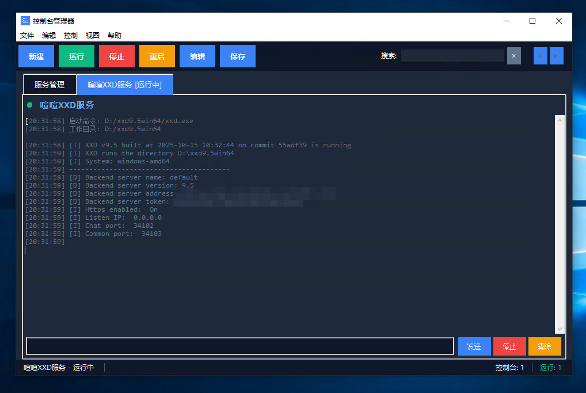
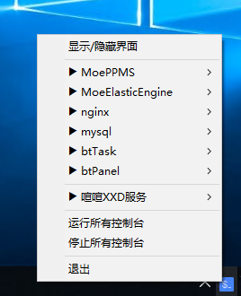

# ConsoleManager

控制台和服务管理器是一个用于管理多个控制台窗口、系统服务的工具，支持多标签页、系统托盘和自动保存配置等功能。

## 功能特点

- **多标签页管理**：在一个窗口中管理多个控制台
- **系统托盘支持**：最小化到托盘，随时控制
- **自动保存配置**：定期自动保存控制台配置
- **全局设置**：开机启动、窗口置顶等选项
- **搜索功能**：快速查找控制台
- **状态显示**：实时显示控制台运行状态

## 截图

### 主界面


### 控制台配置


### 系统托盘


## 安装说明

1. 直接运行 `ConsoleManager.exe` 可执行文件
2. 或通过源码运行：
   ```bash
   python main.py
   ```

## 快捷键

- Ctrl+N: 新建控制台
- Ctrl+S: 保存配置
- Ctrl+E: 编辑控制台
- Delete: 删除控制台
- F5: 刷新
- Alt+F4: 退出程序

## 配置文件

配置文件保存在应用程序运行目录中的 `config.yaml`

## 日志文件

日志文件保存在应用程序运行目录中的 `app.log`

## 许可证

MIT License
